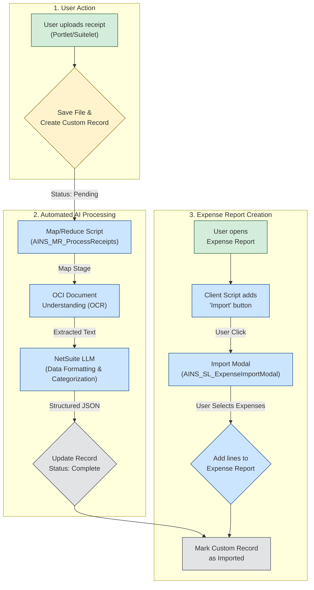

# AI NS Expense Capture System

This project provides a robust, AI-driven solution for automating the expense management lifecycle within NetSuite. It empowers users to effortlessly upload receipts, which are then automatically processed by a sophisticated pipeline utilizing **Oracle Cloud Infrastructure (OCI) Document Understanding** and **NetSuite's native LLM capabilities**. The result is a streamlined workflow that significantly reduces manual data entry, improves accuracy, and accelerates the expense reporting process.

## Key Features

-   **🤖 AI-Powered Data Extraction**: Automatically and accurately extracts key information from receipts, including vendor name, total amount, transaction date, and individual line items.
-   **🧠 Intelligent Expense Categorization**: Leverages a Large Language Model (LLM) to analyze receipt data and intelligently assign the most appropriate expense category, minimizing manual classification.
-   **🔒 Secure & Organized File Storage**: Integrates with NetSuite's **Enhanced File Security**, which automatically creates user-specific folders to store uploaded receipt files securely.
-   **🖥️ Unified User Experience**: Features a modern **Employee Center Portlet** that serves as a central hub for uploading new receipts and monitoring the status of recent submissions in real-time.
-   **Seamless Expense Report Integration**: Adds a custom **"Import Captured Expenses"** button directly onto the Expense Report form, allowing users to pull in processed receipts with a single click.
-   ** scalable Background Processing**: A powerful **Map/Reduce script** handles the entire OCR and LLM processing pipeline, ensuring efficient, reliable, and scalable background execution.
-   **📊 High-Performance Queries**: Exclusively utilizes the `N/query` module for all data retrieval operations, ensuring optimal performance and compatibility across NetSuite environments. [[memory:2252713]]
-   **📝 Comprehensive Logging & Error Handling**: Maintains a detailed audit trail for all operations and includes robust error handling to ensure system stability and simplify troubleshooting.

## Processing Workflow

The system follows a three-stage process: **Upload**, **Automated Processing**, and **Expense Report Integration**. The diagram below illustrates the complete data flow from start to finish.



## System Architecture

The solution is composed of several key components that work together to provide a seamless user experience:

| Component Type          | Name                                 | Purpose                                                                       |
| ----------------------- | ------------------------------------ | ----------------------------------------------------------------------------- |
| **Custom Record**       | AI NS Expense Capture                | Stores all data related to a captured receipt, including the file and AI responses. |
| **Portlet**             | AI NS|PL|Employee Center Portlet     | Provides the main user interface on the Employee Center for uploading receipts. |
| **Suitelet (Upload)**   | AI NS|SL|Receipt Upload              | The user interface for uploading receipt files.                               |
| **Suitelet (Import)**   | AI NS|SL|Expense Import Modal        | A modal window for selecting and importing processed expenses into a report.  |
| **Map/Reduce Script**   | AI NS|MR|Process Receipts            | Orchestrates the background processing of receipts using OCI and LLM.         |
| **Client Script**       | AI NS|CS|Expense Report Import       | Injects the "Import" button onto the Expense Report form.                     |
| **Library (Common)**    | AINS_LIB_Common.js                   | Contains shared constants, validation logic, and utility functions.           |
| **Library (OCI)**       | AINS_LIB_OCIIntegration.js           | Handles the integration with the OCI Document Understanding service.          |
| **Library (LLM)**       | AINS_LIB_LLMProcessor.js             | Handles the integration with the NetSuite LLM service for data enrichment.    |

## Technical Highlights

-   **Security**: Leverages NetSuite's **Enhanced File Security** to ensure that uploaded receipt files are stored in a private, user-specific folder structure (`/Filing Cabinet/Expense Reports/[Employee Name]/`), preventing unauthorized access.
-   **Error Handling**: If the backend AI processing fails, the custom record's status is set to "Error" and a descriptive message is logged. This prevents corrupted or incomplete data from entering the system and provides administrators with clear insights for debugging.
-   **Performance**: The use of a **Map/Reduce script** allows for scalable and efficient background processing of a high volume of receipts. All data lookups are performed with the high-performance **`N/query` module**.

## Project Structure

The project is organized into `Objects` and `FileCabinet` directories, following standard SuiteCloud project structure.

```
Expense Capture/
├── src/
│   ├── Objects/
│   │   ├── customrecord_ains_expense_capture.xml
│   │   ├── customscript_ains_cs_expensereportimport.xml
│   │   ├── customscript_ains_mr_processreceipts.xml
│   │   ├── customscript_ains_pl_employeecenterportlet.xml
│   │   ├── customscript_ains_sl_expenseimportmodal.xml
│   │   └── customscript_ains_sl_receiptupload.xml
│   │
│   └── FileCabinet/
│       └── SuiteScripts/
│           └── AI_NS_ExpenseCapture/
│               ├── ClientScripts/
│               │   └── AINS_CS_ExpenseReportImport.js
│               ├── Libraries/
│               │   ├── AINS_LIB_Common.js
│               │   ├── AINS_LIB_LLMProcessor.js
│               │   └── AINS_LIB_OCIIntegration.js
│               ├── MapReduce/
│               │   └── AINS_MR_ProcessReceipts.js
│               ├── Portlets/
│               │   └── AINS_PL_EmployeeCenterPortlet.js
│               └── Suitelets/
│                   ├── AINS_SL_ExpenseImportModal.js
│                   └── AINS_SL_ReceiptUpload.js
│
├── DEPLOYMENT_GUIDE.md
└── README.md
```

## Prerequisites

Before deploying, ensure your NetSuite environment meets the following requirements:
-   **NetSuite LLM Module**: Must be enabled and configured.
-   **Oracle OCI Document Understanding**: API access must be configured with the necessary credentials.
-   **Enhanced File Security**: Must be enabled in the account.
-   **SuiteScript Version**: NetSuite 2023.1 or later is recommended for full `N/query` support.
-   **Permissions**: Administrator access is required for deployment and configuration.

## Installation & Deployment

For a complete step-by-step guide, please refer to the **[DEPLOYMENT_GUIDE.md](src/FileCabinet/SuiteScripts/AI_NS_ExpenseCapture/DEPLOYMENT_GUIDE.md)**.

A high-level overview of the deployment process is as follows:

1.  **Deploy Custom Objects**: Import the custom record and all script record definitions from the `src/Objects/` directory.
2.  **Upload Script Files**: Upload the entire `AI_NS_ExpenseCapture` directory to `SuiteScripts` in the NetSuite File Cabinet.
3.  **Configure Deployments**: Review and configure the script deployments, ensuring the correct roles are assigned. The Map/Reduce script requires parameters to be set on its deployment record.
4.  **Set Up Employee Center**: Add the "AI Expense Receipt Capture" portlet to the Employee Center dashboard for all relevant employee roles.

## Configuration

The system's behavior can be customized via the script parameters on the Map/Reduce script deployment (`customdeploy_ains_mr_processreceipts`):

-   `custscript_ains_llm_model`: The LLM model to use (e.g., 'command-r').
-   `custscript_ains_confidence_threshold`: The minimum confidence score (0.0-1.0) required for the AI's analysis to be accepted without manual review.
-   `custscript_ains_auto_assign`: A checkbox to enable or disable automatic expense category assignment.

## How to Use

1.  **Upload a Receipt**: Navigate to the Employee Center dashboard and find the **AI Expense Receipt Capture** portlet. Click the **Upload Receipt** button and select your file.
2.  **Wait for Processing**: The Map/Reduce script will automatically pick up your submission and process it. You can monitor the status in the portlet.
3.  **Import into an Expense Report**:
    -   Navigate to `Transactions > Financial > Enter Expense Reports`.
    -   Create a new report or edit an existing one.
    -   Click the **Import Captured Expenses** button.
    -   In the modal window that appears, select the processed receipts you wish to import.
    -   Click **Import Selected**, and the expenses will be added as new lines to your report.

## Future Enhancements
-   **Multi-Language Support**: Extend the AI models to process receipts in languages other than English.
-   **Bulk Processing**: Develop capabilities for uploading and processing multiple receipts at once.
-   **Mobile Integration**: Create a companion mobile interface for capturing receipts on the go.
-   **Analytics Dashboard**: Build a reporting dashboard to provide insights into expense trends and processing metrics.

## Naming Conventions

This project follows a strict naming convention for consistency:
-   **Script Files**: `AINS_<TYPE>_<Description>.js` (e.g., `AINS_MR_ProcessReceipts.js`)
-   **Script Records**: `AI NS|<Type>|<Description>` (e.g., `AI NS|MR|Process Receipts`)
-   **Script IDs**: `customscript_ains_...` for scripts and `customdeploy_ains_...` for deployments. [[memory:2251611]]
-   **Custom Fields**: `custrecord_ains_<field_name>` for the expense capture record.